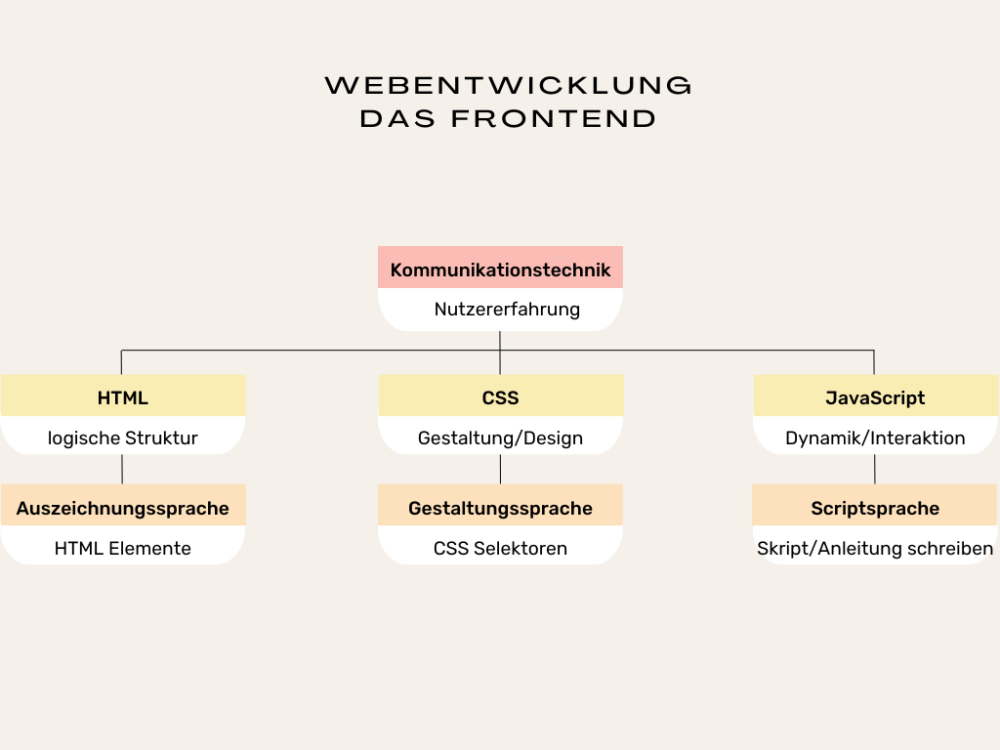

# HTML und CSS Spickzettel 💻🤓💡

## Allgemein

[HTML](#1-html-die-websprache-für-das-gerüst-einer-website) und [CSS](#2-css-die-websprache-für-die-gestaltung-einer-website) sind Websprachen. Sie werden von Webentwickler*innen genutzt, um über den Webbrowser Webauftritte überhaupt erstmal anzeigen zu lassen.  Sobald wir HTML und CSS verwenden, kommunizieren wir mit dem Webbrowser. Wir kommunizieren über Code mit dem Webbrowser, der wiederum den Code den Nutzern unserer Website "übersetzt". Nutzer können sich über eine statische Website über bestimmte Themen informieren. Sobald Nutzer mit der Website (auch oft dann WebApp) interagieren, kommt die Skriptsprache [JavaScript](#3-js-die-websprache-für-die-dynamik-einer-website) hinzu. Alle drei Websprachen zusammen werden im **Frontend** – der Aufgabenbereich, der sich auf die Benutzeroberfläche konzentriert – genutzt. 

<br>

 *Abb.: Websprachen und ihre Aufgaben*


<br><br>
1. [HTML-Elemente](#html-elemente)
  - [Grundstruktur](#grundstruktur-einer-html-seite)
    - [Head-Elemente](#head-elemente-erscheinen-nicht-auf-der-seite-sondern-nur-infos-für-den-browser-und-google)
    - [Body-Elemente](#body-elemente-der-sichtbare-bereich-eurer-webseite)
        - [Block Elemente](#block-elemente-nehmen-die-gesamte-breite-des-elternelements-ein)
        - [Inline Elemente](#inline-elemente-nehmen-nur-die-breite-ihres-inhalts)

2. [CSS-Eigenschaften](#2-css-die-websprache-für-die-gestaltung-einer-website)

3. [JS-Workshop Tag](#3-js-die-websprache-für-die-dynamik-einer-website)

4. [nützliche Tastenkombinationen](#4-nützliche-tastenkombinationen)


<br><br><br>

<!--
## 1. HTML die Websprache für das Gerüst einer Website

## HTML-Elemente
**HTML** steht für ***Hypertext Markup Language*** und ist eine Auszeichnungssprache, die verwendet wird, um den Inhalt einer Webseite zu strukturieren und zu kennzeichnen. HTML ist zuständig für die Markierung verschiedener Elemente wie Überschriften, Fließtexte, Bilder und Links, damit der Webbrowser die Elemente den Nutzern anzeigen und für weitere Zwecke nutzen kann. In der Regel sind HTML Elemente valide – also gültig – wenn sie ein sogenanntes **Start - und Endtag** aufweisen.

```
<p>Ich bin ein Text, der für den Webbrowser als Textabsatz (abgekürzt p) markiert wurde.</p>
```

---

> [!TIP]
> Start- und Endtag bestimmen den Anfang und das Ende der Markierung.

---
---

> [!TIP]
> nur wenn Texte, Bilder etc. richtig markiert wurden, können wir sie später färben, ausrichten, gestalten ohne Verfahrensfehler zu riskieren! 

---

<br><br><br>

### Grundstruktur einer HTML-Seite

| HTML-Element    | Beschreibung                                    | Beispiel                              |
|:---------------:|:-----------------------------------------------:|:-------------------------------------:|
| `<!DOCTYPE html>`| Definiert den Dokumenttyp und die HTML-Version  | `<!DOCTYPE html>`                     |
| `<html>`        | Wurzelelement einer HTML-Seite                  | `<html>...</html>`                    |
| `<head>`        | Enthält Metadaten und Links zu Stylesheets etc. | `<head>...</head>`                    |
| `<body>`        | Enthält den für Nutzer sichtbaren Inhalt der Webseite      | `<body>...</body>`                    |
<br>

**Beispiel**

```
<!DOCTYPE html>
<html>
    <head>...</head>
    <body>...</body>
</html>
```
<br>

> [!TIP]
> `<head>`und `<body>` befinden sich innerhalb des `<html>` Wurzel Elements - diese Elemente sind also in Wurzelelement verschachtelt oder anders gesagt, liegen zwischen **Start- und Endtag** des `<html>`Elements.

<br><br><br>

### Head-Elemente (erscheinen nicht auf der Seite, sondern nur Infos für den Browser und Google)

| HTML-Element | Beschreibung                                           | Beispiel                                 |
|:------------:|:------------------------------------------------------:|:----------------------------------------:|
| `<title>`    | Titel der Webseite, erscheint in der Browser-Tab-Leiste | `<title>Meine Webseite</title>`          |
| `<meta>`     | Metainformationen, z.B. Zeichensatz oder Keywords       | `<meta charset="UTF-8">`                 |
| `<link>`     | Verknüpfung mit externen Dateien, z.B. CSS-Stylesheets  | `<link rel="stylesheet" href="style.css">`|

<br><br><br>

### Body-Elemente (der sichtbare Bereich eurer Webseite)
    
#### Block-Elemente (nehmen die gesamte Breite des Elternelements ein)

| HTML-Element  | Beschreibung                               | Beispiel                             |
|:-------------:|:------------------------------------------:|:------------------------------------:|
| `<h1>`...`<h6>` | Überschriften                            | `<h1>Überschrift</h1>`               |
| `<p>`          | Textabsatz                                | `<p>Textabsatz</p>`                  |
| `<ul>`         | Ungeordnete Liste                         | `<ul><li>Element</li></ul>`          |
| `<ol>`         | Geordnete Liste                           | `<ol><li>Erstes Element</li></ol>`   |
| `<li>`         | Listenelement                             | `<li>Listeneintrag</li>`             |
| `<div>`        | generisches Containerelement                          | `<div>Inhalt</div>`                  |
<br>
##### semantische Containerelemente:

| HTML-Element  | Beschreibung                               | Beispiel                             |
|:-------------:|:------------------------------------------:|:------------------------------------:|
| `<header>`    | Definiert den Kopfbereich eines Dokuments oder einer Sektion. | `<header>Kopfbereich</header>`       |
| `<main>`      | Hauptinhalt des Dokuments, sollte einzigartig sein. | `<main>Hauptinhalt</main>`           |
| `<footer>`    | Definiert den Fußbereich eines Dokuments oder einer Sektion. | `<footer>Fußbereich</footer>`        |
| `<section>`   | Thematisch zusammenhängender Bereich eines Dokuments. | `<section>Abschnitt</section>`       |
| `<nav>`       | Definiert eine Gruppe von Navigationslinks. | `<nav>Navigation</nav>`              |
| `<article>`   | Unabhängiger Artikel, der in sich geschlossen ist. | `<article>Artikel</article>`         |

<br><br>

> [!TIP]
> Ein generisches HTML Element kann als Inhalt alle möglichen anderen Elemente verschachteln ohne spezifisch zu werden. Semantische HTML Elemente definieren ihren Inhalt sehr konkret, so sollte man nicht einen Fließtext mit einem `nav` Element markieren. 

> [!important]
> Je sorgfältiger man von Anfang arbeiten, desto weniger Vorgangsfehler entstehen in der weiteren Entwicklung einer Website.


<br><br><br>
   
#### Inline Elemente (nehmen nur die Breite ihres Inhalts)

| HTML-Element | Beschreibung                    | Beispiel                              |
|:------------:|:-------------------------------:|:-------------------------------------:|
| `<a>`        | Hyperlink (intern, extern)      | `<a href="./unterseite.html"> Dies ist der klickbare Linktext </a>` <br>  `<a href="url"> Die ist der klickbare Linktext. </a>`           |
| `<span>`       | Element, das ausgewählten Bereich makiert  | `<p> Dies ist ein Textabsatz und innerhalb dieses Fließtextes kann ich bestimmte <span>Bereiche</span> zusätlich makieren.</p>`         |
| ``      | Bild einfügen                                 | ``  |

  

## 2. CSS die Websprache für die Gestaltung einer Website


## 3. JS die Websprache für die Dynamik einer Website


-->

## 4. Nützliche Tastenkombinationen

Tastenkombinationen, die in **VS Code** und anderen Programmen funktionieren:

- Fenster wechseln = `Alt` + `Tab`
- Kopieren         = `STRG` + `c`
- Ausschneiden     = `STRG` + `x`
- Einfügen         = `STRG` + `v`
- Suchen           = `STRG` + `f`
- Speichern        = `STRG` + `s`
- alles markieren  = `STRG` + `a`

<!--

### VS-Code

Diese praktischen Kombinationen funktionieren nur in VS Code:
- `Alt` + `Pfeiltaste` = Zeilen verschieben, hoch/runter
- `Alt` + `z`          = Zeilenumbruch anschalten/ausschalten
- `STRG`+ `#`          = erzeugt einen Kommentar 
- `STRG`+ `l`          = Zeile markieren


#### Emmet Abkürzungen in VS Code

Emmet sind Kurzformen, die VS Code zu Code umschreibt, hier einige kurze Beispiele für ***HTML***:
- `!`               = erzeugt in einen Boilerplate-Code (Grundstruktur)
- `lorem50`         = erzeugt einen Lorem-Text mit 50 Worten
- `div.box`         = erzeugt eine `<div class="box">`
- `ul>li*3`         = erzeugt eine `<ul>` mit 3 `<li>`Elementen
- `a{weiterlesen}`  = erzeugt ein `<a href="">weiterlesen</a>`
- `section>img+p+a` = erzeugt eine Sektion und darin ein ``, `<p>`und ein `<a>`

Ihr könnt diese Elemente miteinander kombinieren und damit sehr umfangreiche Codeblöcke bauen. Benutzt diese aber erst, wenn ihr euch mit eurem html sicher seid. Je länger eure Kombinationen sind, desto leichter könnt ihr Fehler produzieren und den Überblick verlieren. Es gibt diese Emmet Abkürzungen auch für CSS. Einen (sehr) umfangreichen Überblick über die verschiedenen Möglichkeiten findet ihr hier:
***[Emmet Cheat Sheet](https://docs.emmet.io/cheat-sheet/)***


-->
